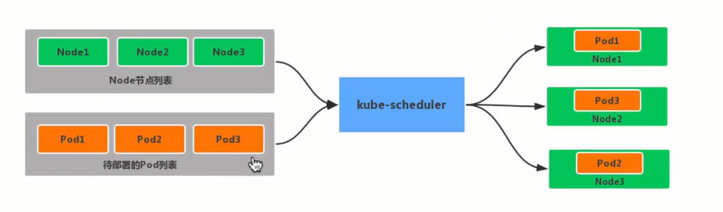
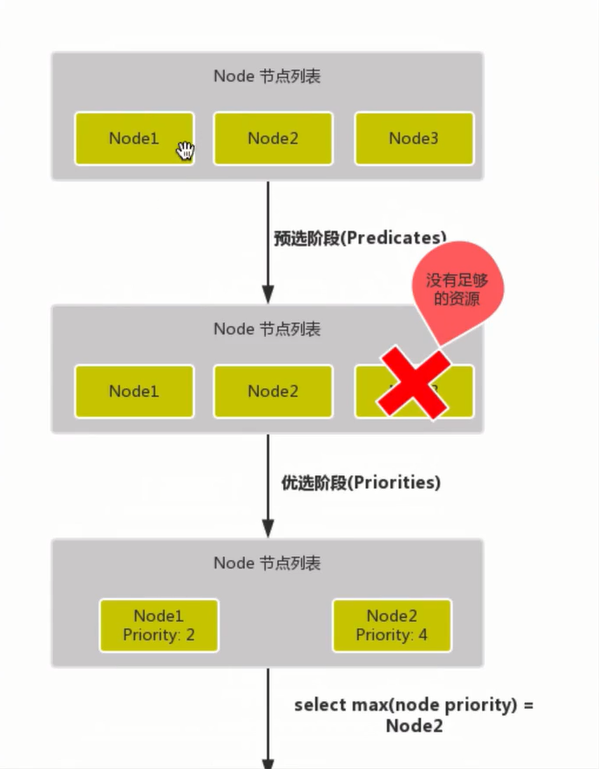

# kube-scheduler

`kube-scheduler`是kubernetes的调度器，它的主要作用就是根据特定的调度算法和调度策略将Pod调度到合适的Node节点上去，是一个独立的二进制程序，启动之后会一直监听API Server，获取到`PodSpec.NodeName`为空的Pod，对每个Pod都会创建一个binding。

这个过程在我们看来好像比较简单，但在实际的生产环境中，需要考虑的问题就有很多了

- 如何保证全部的节点调度的公平性？并不是所有节点资源配置都是一样的
- 如何保证每个节点都能被分配资源？
- 集群资源如何能够被高效利用？
- 集群资源如何才能被最大化使用？
- 如何保证Pod调度的性能和效率
- 用户是否可以根据自己的实际需求定制自己的调度策略

