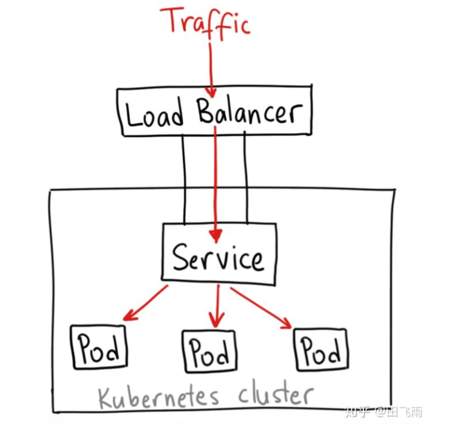
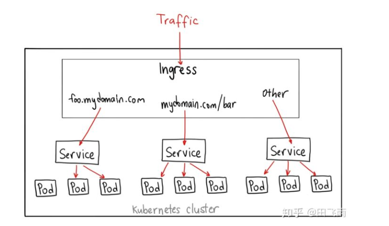

# service

## ClusterIP

ClusterIP 类型的 service 是 kubernetes 集群默认的服务暴露方式，它只能用于集群内部通信，可以被各 pod 访问，其访问方式为：

`pod ---> ClusterIP:ServicePort --> (iptables)DNAT --> PodIP:containePort`

## NodePort

如果你想要在集群外访问集群内部的服务，可以使用这种类型的 service，NodePort 类型的 service 会在集群内部署了 kube-proxy 的节点打开一个指定的端口，之后所有的流量直接发送到这个端口，然后会被转发到 service 后端真实的服务进行访问。Nodeport 构建在 ClusterIP 上，其访问链路如下所示：

`client ---> NodeIP:NodePort ---> ClusterIP:ServicePort ---> DNAT(iptables) ---> PodIP:ContainerPort`

## LoadBalance

LoadBalancer 类型的 service 通常和云厂商的 LB 结合一起使用，用于将集群内部的服务暴露到外网，云厂商的 LoadBalancer 会给用户分配一个 IP，之后通过该 IP 的流量会转发到你的 service 上。

LoadBalancer service 类型的结构如下图所示:

## Ingress

Ingress 其实不是 service 的一个类型，但是它可以作用于多个 service，被称为 service 的 service，作为集群内部服务的入口，Ingress 作用在七层，可以根据不同的 url，将请求转发到不同的 service 上。

Ingress 的结构如下图所示:

