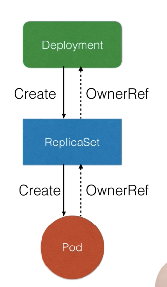
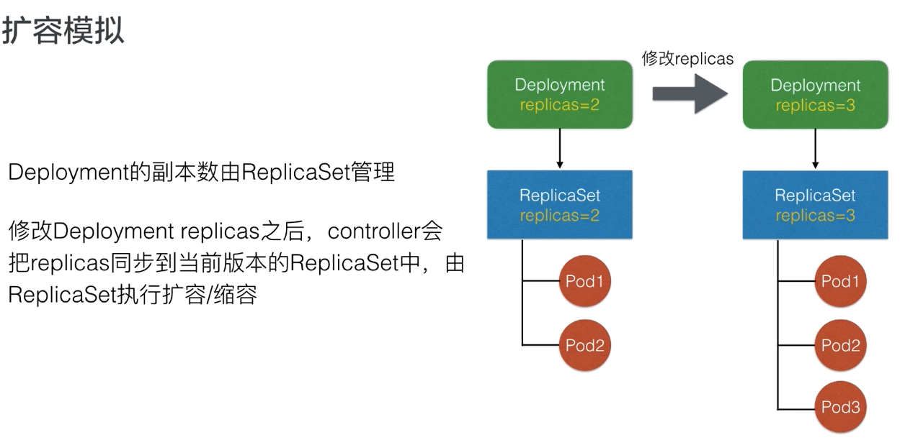
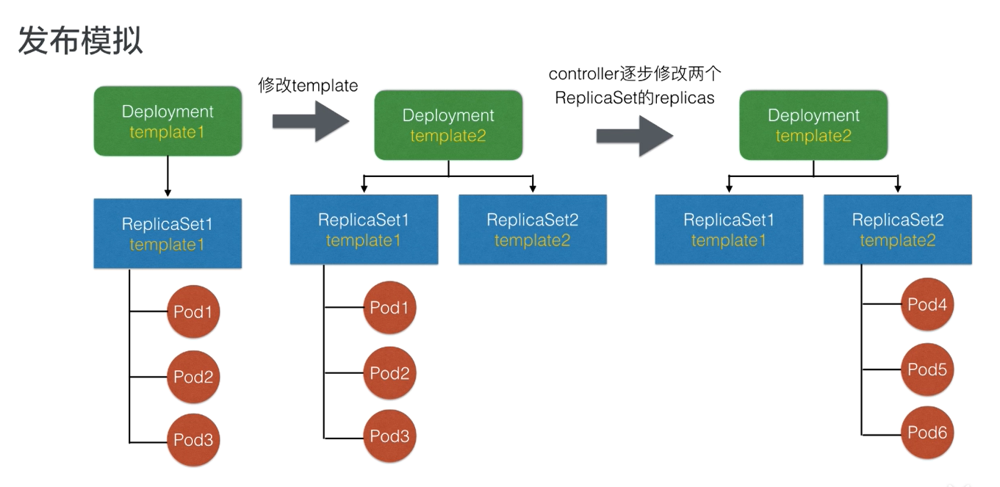
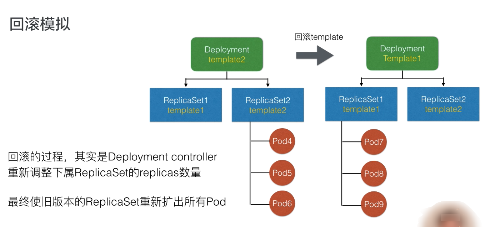

# Deployment

### 背景问题

我们可以直接管理集群中所有的pod吗？

如果这样做，以下问题有什么方式来解决？

1. 如何保证集群内可用的Pod的数量
2. 如何为所有Pod更新镜像版本
3. 更新的过程中，如何保证服务可用性
4. 更新的过程中，发现问题如何快速回滚

### Deployment：管理部署发布的控制器

Deployment能帮我们做什么事情？

1. 定义一组Pod的期望数量，controller会维持Pod数量与期望数量一致
2. 配置Pod发布方式，controller会按照给定策略更新Pod，保证更新过程中不可用的Pod数量在限定范围内
3. 如果发布有问题，支持“一键”回滚

### Deployment语法

```yaml
apiVersion: apps/v1
kind: Deployment
# Deployment元信息
metadata:
  name: nginx-deployment
  labels:
    app: nginx

spec:
  # 期望Pod数量
  replicas: 3
  # Pod选择器
  selector:
    matchLabels:
      app: nginx
  # Pod模板
  template:
    metadata:
      labels:
        app: nginx
    spec:
      containers:
      - name: nginx
        image: nginx:1.7.9
        ports:
        - containerPort: 80
```

### 更新deployment中的容器镜像
```shell
k set image {resources:pod/deploy} {deployment-name} {image-name}={new-image-name}
k set image deployment nginx-deployment nginx=nginx:1.9.1
```

但更新容器之后，deployment控制器会创建新的replicaSet，pod也会重新创建
```
root@k8s-master1 ~# k get rs
NAME                          DESIRED   CURRENT   READY   AGE
nginx-deployment-5f948466b7   2         2         2       4h39m
nginx-deployment-cc7df4f8f    0         0         0       2d
root@k8s-master1 ~# k get po
NAME                                READY   STATUS    RESTARTS   AGE
nginx-deployment-5f948466b7-lbr7q   1/1     Running   0          4h39m
nginx-deployment-5f948466b7-vh97t   1/1     Running   0          4h39m
```

可以看到replicaSet的hash从cc7df4f8f变为了5f948466b7，deployment默认为维护10个replicaSet的历史版本
可以通过`k edit deploy {deployment_name}`修改 `revisionHistoryLimit`字段的值
```
spec:
  progressDeadlineSeconds: 600
  replicas: 2
  revisionHistoryLimit: 10
```

### 资源的部署管理

`kubectl rollout`
```
Manage the rollout of a resource.
  
 Valid resource types include:

  *  deployments
  *  daemonsets
  *  statefulsets

Examples:
  # Rollback to the previous deployment
  kubectl rollout undo deployment/abc
  
  # Check the rollout status of a daemonset
  kubectl rollout status daemonset/foo

Available Commands:
  history     View rollout history
  pause       Mark the provided resource as paused
  restart     Restart a resource
  resume      Resume a paused resource
  status      Show the status of the rollout
  undo        Undo a previous rollout

Usage:
  kubectl rollout SUBCOMMAND [options]
```

```shell
root@k8s-master1 ~# k get deploy
NAME               READY   UP-TO-DATE   AVAILABLE   AGE
nginx-deployment   2/2     2            2           2d
root@k8s-master1 ~# k get rs
NAME                          DESIRED   CURRENT   READY   AGE
nginx-deployment-5f948466b7   2         2         2       4h59m
nginx-deployment-cc7df4f8f    0         0         0       2d
root@k8s-master1 ~# k get po
NAME                                READY   STATUS    RESTARTS   AGE
nginx-deployment-5f948466b7-lbr7q   1/1     Running   0          4h59m
nginx-deployment-5f948466b7-vh97t   1/1     Running   0          4h59m
root@k8s-master1 ~# k rollout undo deploy nginx-deployment
deployment.apps/nginx-deployment rolled back
root@k8s-master1 ~# k get rs
NAME                          DESIRED   CURRENT   READY   AGE
nginx-deployment-5f948466b7   1         1         1       4h59m
nginx-deployment-cc7df4f8f    2         2         1       2d
root@k8s-master1 ~# k get rs
NAME                          DESIRED   CURRENT   READY   AGE
nginx-deployment-5f948466b7   0         0         0       5h
nginx-deployment-cc7df4f8f    2         2         2       2d
root@k8s-master1 ~# 
```

可以看到replicaSet从`5f948466b7`回滚到了之前的版本`cc7df4f8f`


### 管理模式


Deployment只负责管理不同版本的ReplicaSet，由ReplicaSet管理Pod副本数

每个ReplicaSet对应了Deployment template的一个版本

一个ReplicaSet下的Pod都是相同的版本

### 扩容模拟



### 发布模拟



### 回滚模拟

