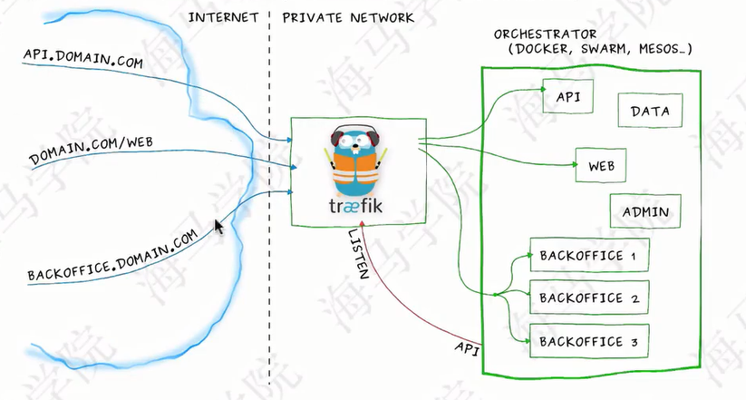

# Ingress

## 介绍
Ingress其实就是从kubernetes集群外部访问集群的一个入口，将外部的请求转发到集群内不同的Service上，其实就相当于nginx，haproxy等负载均衡代理服务器。

是不是可以使用nginx来实现呢？如果使用nginx会有很大的缺陷，每次有新服务加入的时候怎么改nginx配置？不可能让我们去手动更改或者滚动更新前端的nginx pod吧？那我们再加上一个服务发现的工具比如consul呢？貌似是可以，而且在之前单独使用docker的时候，这种方式已经使用的很普遍了，Ingress实际上就是这样实现的，只是服务发现的功能自己实现了，不需要使用第三方的服务了，然后再加上一个域名规则定义，路由信息的刷新需要靠Ingress Controller来提供

Ingress Controller可以理解为一个监听器，通过不断地与kube-apisever打交道，实时的感知后端service，pod的变化，当得到这些变化信息后，Ingress Controller再结合Ingress的配置，更新反向代理负载均衡器，达到服务发现的作用，其实这点和服务发现工具consul非常类似。

可供选择的Ingress Controller有很多，比如traefik，nginx-controller，HAProxy Ingress Controller

## Traefik

traefik是一款开源的反向代理与负载均衡工具。它最大的有点是能够与常见的微服务系统直接整合。可以实现自动化动态配置。目前支持Docker，Kubernetes，consul，etcd，zookeeper等

