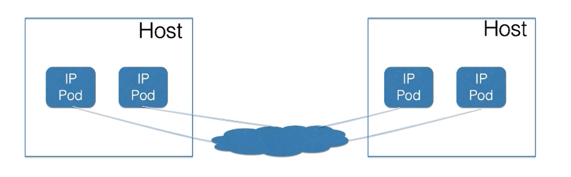

# 网络概念及策略控制

## 基本法：约法三章 + 四大目标

kubernetes对于Pod间的网络没有任何限制，只需满足如下【三个基本条件】

* 所有Pod可以与其它Pod直接通信，无需显示使用NAT
* 所有Node可以与所有Pod直接通信，无需显示使用NAT
* Pod可见的IP地址确为其他Pod与其通信时所用，无需显示转换

基于以上准入条件，我们在审视一个网络方案的时候，需要考虑如下【四大目标】：

* 容器与容器间的通信
* Pod与Pod之间的通信
* Pod与Service间的通信
* 外部与Service间的通信

### 对基本约束的解释

容器与其宿主存在寄生关系，从而在实现上，容器网络方案可分为`Underlay/Overlay`两大派别，
其主要的差异在于是否与`Host`网络同层，这样对于微服务发现及治理，容器可访问方式都造成了
很大的差异，所以社区的同学以`perPodperIP`这种简单的模型，摒弃了显示端口映射等NAT配置，
统一了容器网络对外服务的视角

